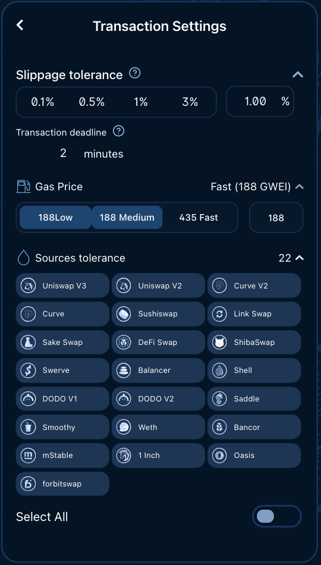

# Beginer's guide

### Step 1: Connect your wallet

* Go to: [https://app.forbitspace.com/](https://app.forbitspace.com/).
* Click on "Connect wallet" button.
* Read and accept Terms of Service and Privacy policy of forbitspace.
* Choose and click on your dApp wallet.

Once the wallet has been connected, your Ethereum address will be displayed on the top of the page.

By clicking on it, you can always check your transaction history, copy the address or disconnect the wallet.

### Step 2: Basic settings

Choose the coin you have and the coin you want to get in the dropdown windows:

You can also choose between the 'Lowest gas' and 'Max return' options. If you choose the 'Maximum return' option, the algorithm will use complex routes for the swap to make sure that you get the best rates.

Alternatively, you can go for the 'Lowest gas' option. In that case, the pathfinder algorithm will find the best option in terms of gas costs. This option comes in handy for small trades when you don’t want to pay substantial fees, like, for instance, swapping 10 USDT to WETH. Small trades optimize less liquidity sources and thus the lowest gas cost option will most likely deliver the best end price.

### Step 3: Advanced settings

forbitspace enables you to do more advanced settings. Hit the ‘Advanced settings’ button in the upper right corner of the swap console.

The ‘Disable partial fill’ button disables the particle fill feature, which is enabled by default. The partial fill feature can fill a swap order only partially — in case the rate in one or more routes has changed, becoming less attractive for the user. Thanks to the partial fill feature, any route can be easily cancelled, and the user’s unswapped coins will return to their wallet.

The advanced settings also allow a user to see a comparison table, charts and the entire routing for the swap they want to do.

With the advanced settings, the user can set _slippage tolerance_, the gas price and choose between the 31 liquidity sources 1inch offers.

The _slippage tolerance_ feature allows the user to select their swap’s level of slippage. The user can choose: 0.1 %, 0.5%, 1 %, 3% or they can enter a custom amount. If the rate changes more than the selected percentage of “slippage tolerance” during the execution of the transaction, the transaction will be partially filled or reverted to save user funds

### Step 4: Swap

